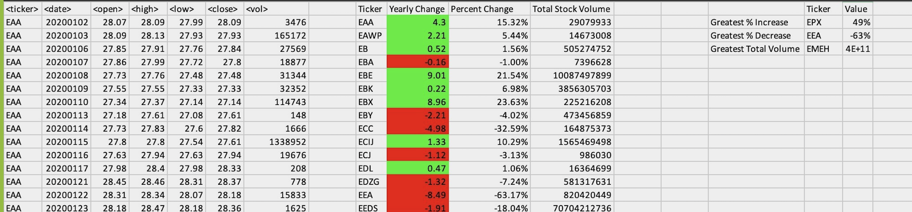

# VBA Analysis

## Description
It has a VBA script that summarizes stock data.

## Table of Contents
- [Installation](#installation)
- [Usage](#usage)
- [Credits](#credits)
- [License](#license)
- [Features](#features)
- [Tests](#tests)
- [Contact](#contact)

## Installation
excel, VBA

## Usage
run Stock.bas module

## Credits
Catherine Matthews

## License
MIT

## Features
It provides yearly summary in which it brings out the greatest increase and greatest decrease and largest stock value.

## Tests
confirm that the summary columns are created in every sheet of the workbook 

## Contact
If there are any questions of concerns, I can be reached at:
##### [github: mattcat1221](https://github.com/mattcat1221)
##### [email: caseyvmatthews@gmail.com](mailto:caseyvmatthews@gmail.com)
